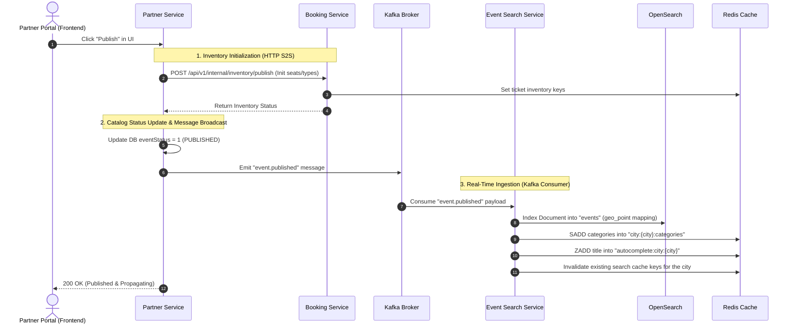

# Event Publishing & Search Ingestion Pipeline Architecture

This document describes the end-to-end event-driven architecture that executes when an event is published. It spans the **Partner**, **Booking**, and **Event Search** microservices, detailing the interactions with **Kafka**, **OpenSearch**, and **Redis**.

---

## 1. End-to-End Pipeline Overview

The system follows a decoupled Command Query Responsibility Segregation (CQRS) and event-driven read/write architecture:
1. **Write Path (Transactional)**: Partner Service saves structural event definitions (drafts). Upon publication, it requests the Booking Service to create ticket inventories, updates database status, and broadcasts a message to Kafka.
2. **Read Path (Search Ingestion)**: The Event Search Service listens to the Kafka broadcast, indexes the event into OpenSearch for fuzzy geo-spatial searches, and maps terms to multiple Redis caching layers to minimize search latency.



---

## 2. Kafka Message Payload (`event.published`)

The Kafka message emitted on the `event.published` topic has the following structure (JSON format):

```json
{
  "id": "bd914985-7470-4f5f-bb29-06ace029aa54",
  "name": "Summer Music Festival 2024",
  "category": "music",
  "description": "Join us for an unforgettable night of live music under the stars.",
  "backgroundImage": "https://example.com/image.png",
  "eventDate": "2024-07-15T00:00:00.000Z",
  "startTime": "18:00",
  "endTime": "23:00",
  "venueName": "Sunset Arena",
  "location": "Los Angeles, CA",
  "city": "Los Angeles",
  "state": "CA",
  "zipCode": "90001",
  "latitude": 34.0522,
  "longitude": -118.2437,
  "ticketSalesClose": "2024-07-14T23:59:00.000Z",
  "noteToAttendees": "Please bring your ID.",
  "termsConditions": "No refunds.",
  "refundPolicy": "Full refund if cancelled.",
  "ticketTypes": [
    {
      "id": "a1b2c3d4-e5f6-7a8b-9c0d-1e2f3a4b5c6d",
      "name": "Couple Ticket",
      "categoryCode": "CUP",
      "price": 9.0,
      "quantity": 99
    }
  ]
}
```

---

## 3. OpenSearch Document Structure & Index Mapping

The Event Search Service indexes the event in the `events` index. To support fuzzy search and proximity filters, coordinates are mapped using the `geo_point` data type.

### Index Mapping (`events`)
```json
{
  "mappings": {
    "properties": {
      "id": { "type": "keyword" },
      "name": { "type": "text" },
      "category": { "type": "keyword" },
      "description": { "type": "text" },
      "backgroundImage": { "type": "keyword", "index": false },
      "eventDate": { "type": "date" },
      "startTime": { "type": "keyword" },
      "endTime": { "type": "keyword" },
      "venueName": { "type": "text" },
      "location": { "type": "geo_point" },
      "city": { "type": "keyword" },
      "state": { "type": "keyword" },
      "zipCode": { "type": "keyword" },
      "ticketSalesClose": { "type": "date" },
      "noteToAttendees": { "type": "text" },
      "termsConditions": { "type": "text" },
      "refundPolicy": { "type": "text" },
      "ticketTypes": {
        "type": "nested",
        "properties": {
          "id": { "type": "keyword" },
          "name": { "type": "text" },
          "categoryCode": { "type": "keyword" },
          "price": { "type": "float" },
          "quantity": { "type": "integer" }
        }
      }
    }
  }
}
```

---

## 4. Redis Cache Layers & Key Structures

The architecture leverages four distinct Redis caches to speed up transactions and user queries:

### Tier 1: Static Category Dropdown (Pre-fetched)
*   **Key**: `city:{city_name}:categories`
*   **Data Structure**: `SET`
*   **Command**: `SADD city:los_angeles:categories music`
*   **Goal**: Populates event filter dropdown lists on landing.

### Tier 2: Real-time Autocomplete Suggestions (Prefix Matching)
*   **Key**: `autocomplete:city:{city_name}`
*   **Data Structure**: Sorted Set (`ZSET`) where all scores are `0` to enforce lexicographical ordering.
*   **Command**: `ZADD autocomplete:city:los_angeles 0 "summer music festival"`
*   **Lex Query**: `ZRANGEBYLEX autocomplete:city:los_angeles "[sum" "[sum\xff"`
*   **Goal**: Serves top 5 autocomplete completions as the user types.

### Tier 3: Spatially-Grouped Search Cache
*   **Key**: `search:city:{city}:geohash:{g_hash}:date:{YYYYMMDD}:q:{sanitized_query}:page:{page}`
*   **Data Structure**: String (JSON Array of closest 20 events)
*   **TTL**: `300 seconds` (5 minutes)
*   **Command**: `SETEX search:city:los_angeles:geohash:9q5cs:date:20260606:q:summer:page:1 300 "[...events]"`
*   **Goal**: Converts high-precision GPS coordinates into a **Level 5 Geohash** (~4.9km bounding box) to group users in the same locality, maximizing cache-hits.

### Booking Tier: Real-time Ticket Counters
*   **Key**: `event:{eventId}:ticketType:{ticketTypeId}:inventory`
*   **Data Structure**: String (Numeric Counter)
*   **Command**: `DECRBY event:bd914985...:ticketType:a1b2c3d4...:inventory 2`
*   **Goal**: Real-time atomic decrements to prevent race-condition ticket sales.
