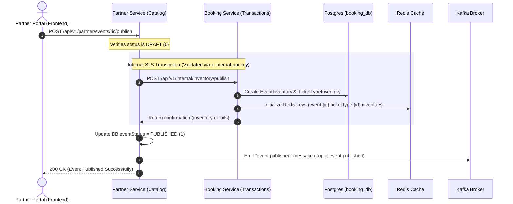

# Partner-Booking Inventory Transaction Architecture

This document describes the service-to-service (S2S) communication, transactional data structures, and security patterns when a partner publishes an event.

---

## 1. S2S Authentication (`INTERNAL_API_KEY`)

When microservices in the Tikitu cluster communicate directly, they bypass public Cognito user authentication. To secure these internal channels, they utilize a shared secret API key:

*   **Key**: `INTERNAL_API_KEY` (configured as `tikitu-dev-internal-key` in development).
*   **Header**: `x-internal-api-key`.
*   **Validation**: The receiving service intercepts the call using `InternalApiKeyGuard` to verify that the request contains the correct key.

---

## 2. Ingestion Flow: Draft ➔ Publish

When an event is published, it transitions from a catalog draft into an active, bookable transaction inventory.

---

## 3. Data Sync & Inventory Creation

The transaction transfers the structural "event template" (catalog) into the transactional "active inventory".

### Data Transferred

| Field | Description | Target in Booking Service |
| :--- | :--- | :--- |
| `catalogEventId` | The unique ID of the event in Partner catalog | `EventInventory.catalogEventId` (linked) |
| `ticketTypes` | Array of `{ id, name, price, quantity }` | `TicketTypeInventory` table |
| `venueId` | Venue ID or Fallback `addressId` | `EventInventory.venueId` |
| `totalSeats` | Sum of all ticket type quantities | `EventInventory.totalSeats` & `availableSeats` |

### Redis Key Initialization
For each ticket type in the payload, the booking service creates a key in Redis to perform rapid seat deductions:
*   **Redis Key**: `event:{eventInventoryId}:ticketType:{ticketTypeInventoryId}:inventory`
*   **Value**: `{quantity}` (e.g. `99`)
*   **Purpose**: Protects against race conditions (double-booking) when hundreds of concurrent users attempt to buy tickets simultaneously.
